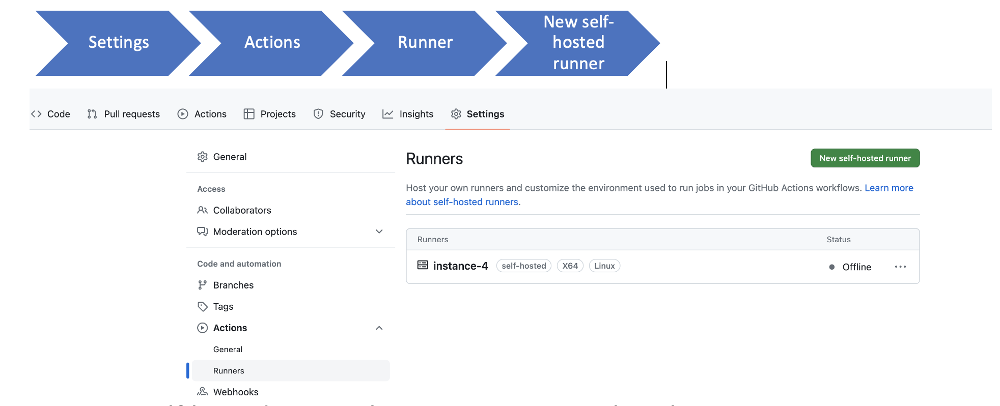
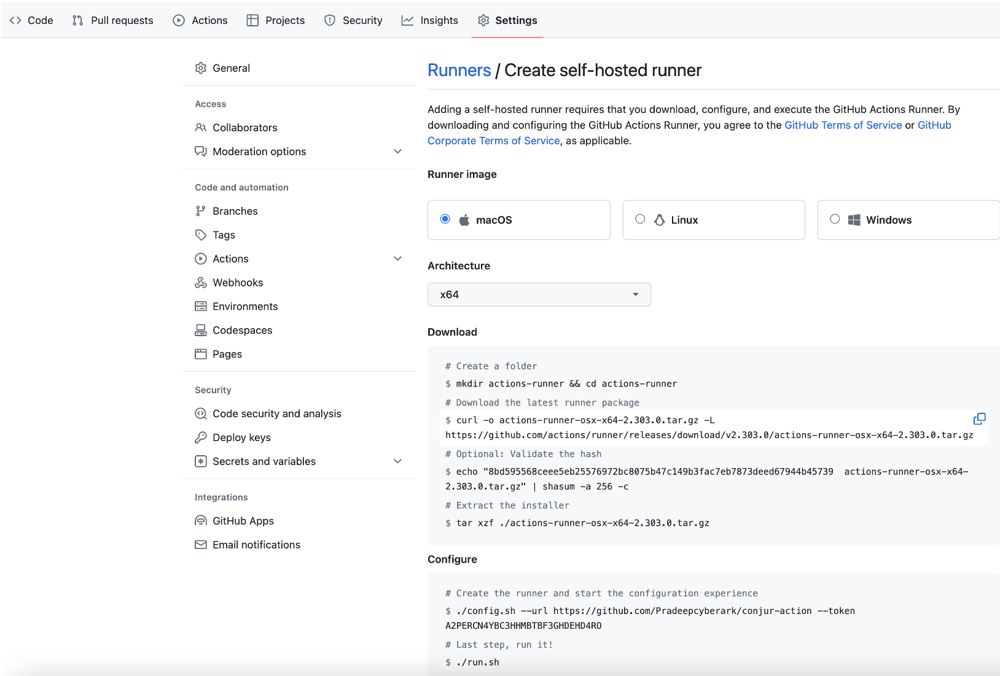
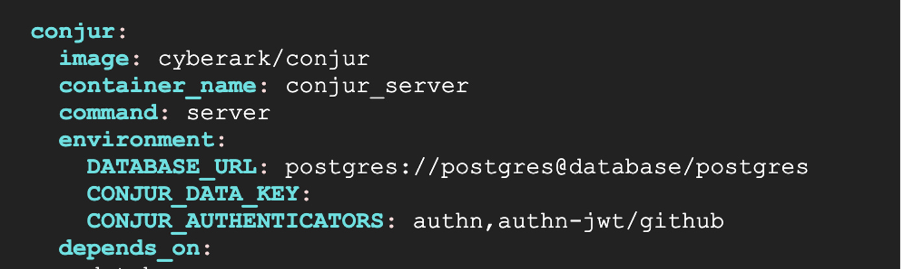

# CyberArk Conjur Secret Fetcher

GitHub Action for secure secrets delivery to your workflow test environment using CyberArk Conjur.

Supports authenticating with CyberArk Conjur using host identity and JWT authentication.

## Certification level
[](https://github.com/cyberark/community/blob/master/Conjur/conventions/certification-levels.md)

This repository is a **Certified** level project. It's a community contributed project **reviewed and tested by CyberArk
and trusted to use with Conjur Open Source**. For more detailed information on our certification levels, see [our community guidelines](https://github.com/cyberark/community/blob/master/Conjur/conventions/certification-levels.md#certified).

## Requirements

* Docker and access to DockerHub.
* Github
* Github self hosted Runner
* Conjur Secrets Manager Enterprise v10+
* Conjur Secrets Manager Open Source v1.1+

## Setup

### Prerequisite for running github runner on VM.
1. Install docker (Docker must be install as not root user) --- for Linux OS
 * Modify Sudoers File (vi /etc/sudoers)
   ```yaml 
   runner ALL=(ALL) ALL
   ```
 * Run command to create group and add user.
   ```yaml
   sudo adduser newuser
   sudo groupadd newgroup_name
   sudo usermod -aG docker ${USER}
   su - ${USER}
   id -nG
   ```
 * Step to install docker 
   ```yaml
   sudo apt update
   sudo apt install apt-transport-https ca-certificates curl software-properties-common
   curl -fsSL https://download.docker.com/linux/ubuntu/gpg | sudo apt-key add –
   sudo add-apt-repository "deb [arch=amd64] https://download.docker.com/linux/ubuntu bionic stable"
   sudo apt update
   apt-cache policy docker-ce
   sudo apt install docker-ce
   sudo systemctl status docker
   ```
2. Configration of Github action runner in your system.

 * Project Github repo and follow the steps below.
      

 * To create self-hosted runner there are 3 images. Select the image as per your requirement and follow step to download and configure the runner.
      

3. Conjur Setup

 * Need conujr up and running state.
 * Need to Enable the authenticators for JWT authentication.
      
   
## Host Identity
### API Key Based Authentication configuration for .github/workflows .yml file

### Example

```yaml
on: [push]

jobs:
  test:
    # ...
    steps:
      # ...
      - name: Import Secrets using CyberArk Conjur Secret Fetcher Action
        uses: cyberark/conjur-action@v2.0.5
        with:
          url: ${{ secrets.CONJUR_URL }}
          account: cyberarkdemo
          host_id: ${{ secrets.CONJUR_USERNAME }}
          api_key: ${{ secrets.CONJUR_API_KEY }}
          secrets: db/sqlusername|sql_username;db/sql_password
      # ...
```

### Arguments

#### Required

* `url` - this is the path to your Conjur instance endpoint.  e.g. `https://conjur.cyberark.com:8443`
* `account` - this is the account configured for the Conjur instance during deployment.
* `host_id` - this is the Host ID granted to your application by Conjur when created via policy. e.g. `host/db/github_action`
* `api_key` - this is the API key associated with your Host ID declared previously.
* `secrets` - a semi-colon delimited list of secrets to fetch.  Refer to [Secrets Syntax](#secrets-syntax) in the README below for more details.

#### Optional

* `certificate` - if using a self-signed certificate, provide the contents for validated SSL.
* `authn_token_file` - this is the file path for the Conjur auth token.

#### Not required
* `authn_id` - this is the ID of Authn-JWT at Conjur

### JWT Authentication configuration for .github/workflows .yml file

### Example

```yaml
on: [push]

jobs:
  test:
    # ...
    permissions:
      id-token: 'write'
      contents: 'read'
    steps:
      # ...
      - name: Import Secrets using CyberArk Conjur Secret Fetcher Action
        uses: cyberark/conjur-action@v2.0.5
        with:
          url: ${{ secrets.CONJUR_URL }}
          account: cyberarkdemo
          authn_id: ${{ secrets.CONJUR_AUTHN_ID }}
          secrets: db/sqlusername|sql_username;db/sql_password
      # ...
```

### Arguments

#### Required

* `url` - this is the path to your Conjur instance endpoint.  e.g. `https://conjur.cyberark.com:8443`
* `account` - this is the account configured for the Conjur instance during deployment.
* `authn_id` - this is the ID of Authn-JWT at Conjur
* `secrets` - a semi-colon delimited list of secrets to fetch.  Refer to [Secrets Syntax](#secrets-syntax) in the README below for more details.

#### Optional

* `certificate` - if using a self-signed certificate, provide the contents for validated SSL.

#### Not required
* `host_id` - this is the Host ID granted to your application by Conjur when created via policy. e.g. `host/db/github_action`
* `api_key` - this is the API key associated with your Host ID declared previously.
* `authn_token_file` - this is the file path for the Conjur auth token.

### Conjur OSS or Enterprise Setup 

JWT Authenticator is required at Conjur server.  You may wish to refer to [official doc](https://docs.cyberark.com/Product-Doc/OnlineHelp/AAM-DAP/Latest/en/Content/Operations/Services/cjr-authn-jwt.htm?tocpath=Integrations%7CJWT%20Authenticator%7C_____0) 

The sample policy below validates GitHub repository & workflow

1. [Sample authenticator policy](github-authn-jwt.yml)
2. [Sample app id policy](github-app-id.yml)

* Create a Conjur policy for the JWT Authenticator

```yaml
- !policy
  id: conjur/authn-jwt/github
  body:
      - !webservice

      #Mandatory variable: The JWT provider URI
      #Uncomment either 'provider-uri' OR 'jwks-uri'

      #- !variable
      #    id: provider-uri

      # jwks-uri for GitHub Actions: https://token.actions.githubusercontent.com/.well-known/jwks
      - !variable
        id: jwks-uri

      #Optional variables
      #Uncomment one or all of the following optional variables.
      #Note: If you uncomment 'token-app-property' you must also uncomment 'identity-path',
      #and vice versa;

      #In this example, "token-app-property" is set to "workflow"
      #Please refer to README.md for detailed policy and commands
      - !variable
        id: token-app-property

      #In this example, "identity-path" is set to "/github-apps"
      #Please refer to README.md for detailed policy and commands
      - !variable
        id: identity-path

      #"issuer" for GitHub Actions: https://token.actions.githubusercontent.com
      - !variable
        id: issuer
        
      #In this example, "enforced-claims" is set to "workflow,repository"
      #Please refer to README.md for detailed policy and commands
      - !variable
          id: enforced-claims

      #- !variable
      #    id: mapping-claims

      #- !variable
      #    id: audience

      #Group of applications that can authenticate using this JWT Authenticator
      - !group apps

      - !permit
        role: !group apps
        privilege: [read, authenticate]
        resource: !webservice

      - !webservice
        id: status

      #Group of users who can check the status of the JWT Authenticator
      - !group
        id: operators

      - !permit
        role: !group operators
        privilege: [read]
        resource: !webservice status
```

 - Load the policy into root:
  ```
    conjur policy load -f /path/to/file/github-authn-jwt.yml -b root
  ``` 

* Populate the policy variables

```
conjur variable set -i conjur/authn-jwt/github/issuer -v "https://token.actions.githubusercontent.com"
conjur variable set -i conjur/authn-jwt/github/jwks-uri -v "https://token.actions.githubusercontent.com/.well-known/jwks"
conjur variable set -i conjur/authn-jwt/github/token-app-property -v "workflow"
conjur variable set -i conjur/authn-jwt/github/enforced-claims -v "workflow,repository"
conjur variable set -i conjur/authn-jwt/github/identity-path -v "/github-apps"
```

* Define an app ID (host)

```yaml
- !policy
  id: github-apps
  body:
      - !group

      - &hosts
        - !host
          id: release
          annotations:
              authn-jwt/github/repository: my-repo/conjur-action
              authn-jwt/github/workflow: release

      - !grant
        role: !group
        members: *hosts

- !grant
  role: !group conjur/authn-jwt/github/apps
  member: !group github-apps
```

  - Load the policy into root:
  ```
  conjur policy load -f /path/to/file/github-app-id.yml -b root
  ```

* Secret Variables and Permissions:

```yaml
- &devvariables
   - !variable Dev-Team-credential1
   - !variable Dev-Team-credential2
   - !variable Dev-Team-credential3
   - !variable Dev-Team-credential4
- !permit
  resource: *devvariables
  privileges: [ read, execute ]
  roles: !group gitlab-apps
```
  - Load the policy into root:
  ```
    conjur policy load -f /path/to/file/authn-jwt-secret-variables.yml -b root
  ``` 

* Set the secret variable   
     a. Generate a secret

     Generate a value for your application’s secret:
     ```
     secretVal=$(openssl rand -hex 12 | tr -d '\r\n')
     ```

     This generates a 12-hex-character value.

     b. Store the secret

     Store the generated value in Conjur:
     ```
     conjur variable set -i Dev-Team-credential1 -v ${secretVal}
     ```

### Conjur Cloud Setup
Pre-requisite:
- Conjur cloud
- Pcloud
- Conjur cloud cli

<small><a href='https://docs-er.cyberark.com/ConjurCloud/en/Content/ConjurCloud/ccl-manage-users.htm?tocpath=Get%20started%7CTutorial%7C_____1'>Refer the tutorial for Conjur Cloud Setup </a></small>

1. Manage Conjur Cloud users
2. Set up the Conjur Cloud CLI
3. Log in to Conjur Cloud
4. Sync Privilege Cloud Safe to Conjur

To create a simple host that authenticates using an API key:

Create a policy for the host:

```yaml
- !host
  id: <host name>
  annotations:
    authn/api-key: true
```    
Save the policy as myapp-host.yaml.

Load the policy file into the data policy branch:

```
conjur policy load -b data -f myapp-host.yaml
```

To grant permissions on secrets:

```yaml
- !grant
  role: !group delegation/consumers
  member: !host /data/myapp
```

Save the file as grant_permissions.yml.

Load the policy to data/vault/secrets-safe:

```
conjur policy load -b data/vault/secrets-safe -f grant_permissions.yml
```

## Secrets Syntax for .github/workflows .yml file

`{{ conjurVariable1|envVarName1;conjurVariable2 }}`

The `secrets` argument is a semi-colon (`;`) delimited list of secrets. Spaces are NOT SUPPORTED. The list can optionally contain the name to set for the environment variable.

### Example

`db/sqlusername|sql_username;db/sql_password`

In the above example, the first secret section is `db/sqlusername|sql_username`.  The `|` separates the Conjur Variable ID from the environment variable that will contain the value of the Conjur Variable's value.

The second secret section is `db/sql_password`.  When no name is given for the environment variable, the Conjur Variable Name will be used.  In this example, the value would be set to `SQL_PASSWORD` as the environment variable name.

## Security

### Protecting Arguments

It is recommended to set the URL, Host ID, and API Key values for the Action to function as secrets by going to Settings > Secrets in your GitHub repository and adding them there.  These can then be called in your workflows' YAML file as a variable: `${{ secrets.SECRETNAME }}`

### Masking

The CyberArk Conjur Secret Fetcher GitHub Action utilizes masking prior to setting secret values to the environment.  This prevents output to the console and to logs.

## License

[MIT](LICENSE)
